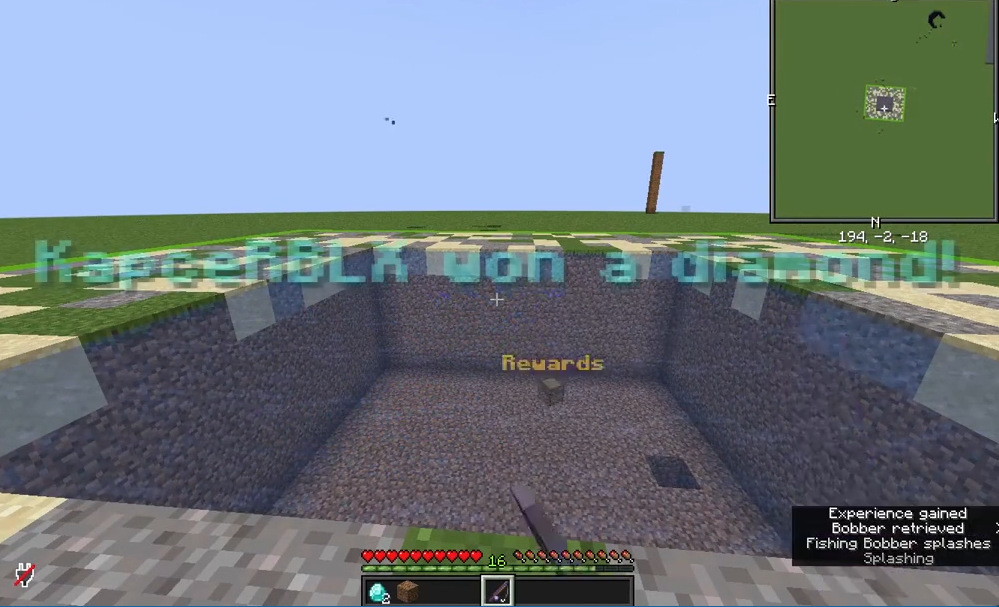

# FishyBusiness



FishyBusiness is a minigame minecraft plugin designed for lobbies. You can set
up your own areas where players will enter fishing mode and fish for rewards.
Once player leaves the area their inventory will be loaded from backup.

FishyBusiness is modular, there are multiple soft dependencies for areas and
rewards. For example you can give your players money as reward when using Vault.

By default there is support for:

- Vault - giving players money as reward (economy-providing plugin is required)
- WorldGuard - defining areas using worldguard regions, supports worldguard
  flags
- PlaceholderAPI - support for placeholders in messages, command and message
  rewards

## Using FishyBusiness as dependency

Add jitpack repository to your project.

Gradle:

```groovy
maven { url = "https://jitpack.io" }
```

Maven:

```xml

<repository>
    <id>jitpack.io</id>
    <url>https://jitpack.io</url>
</repository>
```

Add the plugin as dependency.

Gradle:

```groovy
compileOnly "com.github.KaspianDev:FishyBusiness:master-SNAPSHOT"
```

Maven:

```xml

<dependency>
    <groupId>com.github.KaspianDev</groupId>
    <artifactId>FishyBusiness</artifactId>
    <version>master-SNAPSHOT</version>
</dependency>
```

Add the plugin to `depend` or `softdepend` in `plugin.yml`.

```yml
depend: [ FishyBusiness ]
```

The API currently only contains 2 events:

- `AreaEnterEvent` - Triggers when player enters a defined area. This will also
  trigger when player spawns in area when joining the server.
- `AreaLeaveEvent` - Triggers when player leaves an area. This will also trigger
  when player leaves the server while being inside an area.

## Building:

```sh
git clone https://github.com/KaspianDev/FishyBusiness.git
```

```sh
./gradlew build
```

Artifact will be located in build/libs.
